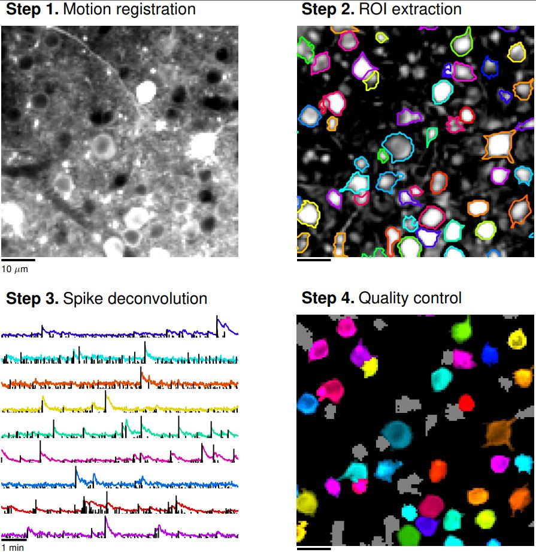

## SUITE2P

Let's learn how to process 2P clacium imaging. There are four main steps:

1. Motion correction [slides](../LectureSlides/Day9/MotionCorrection.pdf), [notebook](motion_correction.ipynb)
2. Cell detection [notebook], [slides]
3. Spike deconvolution [notebook], [slides]
4. Manual curation (inspect data in GUI)

